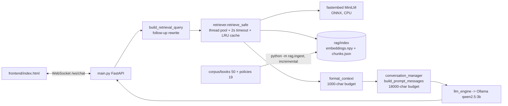

# Riverbend Library Assistant (Assignment 2: RAG)

A fully **local, CPU-only** chatbot for a community library. Assignment 1 gave
it a local LLM (Ollama `qwen2.5:3b`, Q4_K_M), a FastAPI WebSocket backend and
a web frontend. Assignment 2 adds **Retrieval-Augmented Generation**: answers
are grounded in a 69-document library corpus and cite their source documents.
No cloud API and no external tools are used anywhere.

> **Numbers policy.** Every number in this README is either a fixed design
> parameter or was measured on the machine listed in §7 with the command
> shown next to it. Nothing was estimated.

---

## 1. Use case

Front-desk assistant for *Riverbend Community Library*: hours, membership tiers,
borrowing/renewals, fines, holds, rooms, printing, and whether a given book is
in the catalogue. It refuses off-topic requests and resists jailbreaks.

## 2. Architecture



Per message: embed the query (follow-ups such as "how many copies of it?"
inherit the previous patron message), cosine-search the index, keep the top
`k=4` chunks scoring ≥ `0.30`, format them under a 1000-char budget, attach
them to the **current user turn**, stream the model's answer unchanged, and
send the sources on the final `done` event.

## 3. WebSocket contract (unchanged)

Client → server `{"session_id": "...", "message": "..."}`; server → client
`{"type":"token"|"done"|"error", ...}` with the same required fields as
Assignment 1. The **only** addition is an *optional* `sources` array on `done`
(`[{"title","source"}]`, deduplicated, relevance order, absent when nothing was
retrieved). A client that ignores it behaves exactly like Assignment 1. Extra
endpoints: `GET /rag/status`, `POST /rag/reload`.

## 4. Design choices and why

### 4.1 Embedding model: `all-MiniLM-L6-v2` via fastembed
384-dim, ~90 MB, runs on CPU through ONNX Runtime. Chosen because it is small
and fast enough for sub-second query embedding, good at short English
passages, and fastembed ships prebuilt wheels (PyTorch / sentence-transformers
repeatedly failed to build on Python 3.14 in Assignment 1). Alternative
considered: `bge-small-en-v1.5` (slightly better quality, similar size);
MiniLM was kept for the smaller footprint.

### 4.2 Vector store: flat numpy index (deliberate substitution)
The brief lists "Chroma, FAISS, etc". A flat index is *exactly* what FAISS
`IndexFlatIP` does: exact dot-product over L2-normalised vectors (= cosine).
With ~77 vectors this takes well under a millisecond, so an ANN library would
add install risk (native wheels on Python 3.14) and no speed benefit. The
whole system only touches `retrieve(query, k)`, so swapping in FAISS/Chroma is
a one-file change. Persistence: `embeddings.npy` + `chunks.json`.

### 4.3 Corpus (69 documents, within 50–100)
50 book entries + 19 policy documents, all original text (no copied blurbs).
Facts are kept consistent across documents (loan periods, pickup windows,
Premium benefits) and a test ties the static knowledge base to the corpus.

### 4.4 Chunking
Document-aware paragraph packing: `MAX_WORDS=110`, `OVERLAP_WORDS=25`,
`MIN_CHUNK_WORDS=20`; oversized paragraphs fall back to sentence splitting and
tiny fragments merge into neighbours. Documents are short and coherent, so
fixed-size splitting would cut facts in half. Result: **77 chunks** from 69
documents. The document title is prepended to the text that gets embedded, so
"Atomic Habits" in a query matches that book's chunk.

### 4.5 Top-k and threshold
`TOP_K = 4` (brief requires ≥ 3: enough to cover multi-fact questions such as
"Premium vs Standard", small enough to protect the context window).
`MIN_SCORE = 0.30` makes "no relevant match" a first-class outcome rather than
forcing weak chunks in. It was chosen from a measured sweep on the real model
(`python eval_retrieval.py --sweep`, 51 in-domain + 12 must-match-nothing
queries, `eval/retrieval_queries.json`):

| MIN_SCORE | in-domain hit@4 | no-match correctly empty |
|---|---|---|
| 0.20 | 45/48 | 7/12 |
| **0.30 (chosen)** | **45/48** | **9/12** |
| 0.35 (initial guess) | 42/48 | 9/12 |
| 0.45 | 34/48 | 11/12 |
| 0.50 | 31/48 | 12/12 |

Final setting (0.30), 51 in-domain queries: hit@1 88% (45/51), hit@4 94% (48/51),
MRR 0.91, no-match correct 9/12 (the threshold sweep below used the first 48 queries). At the initial 0.35: hit@1 79%, hit@4 88%, MRR 0.83.
0.30 dominates 0.35 on this set (more hits, same no-match score). Caveat: the threshold was tuned on the same
queries it is evaluated on, so treat the numbers as indicative.

**Relative margin (evaluated, not adopted).** An optional `REL_MARGIN` drops
chunks scoring more than M below the best. On the same 48 queries, M = 0.10
keeps hit@4 at 45/48 (MRR 0.878) and cuts the average documents from 3.17 to
1.98, but M <= 0.07 loses hits. It is left **off** (`0.0`) because the brief
requires k >= 3 and trimming below three candidates would contradict that.

**Citations match the prompt.** Retrieval returns k = 4 chunks, but the excerpt
budget (`MAX_CONTEXT_CHARS = 1000`) may fit fewer. Sources shown to the patron
are built only from the chunks that were actually injected
(`select_for_context`), so the UI never cites a document the model did not see
(a test enforces this).

**Follow-ups.** `build_retrieval_query` rewrites a short follow-up ("how many
copies of it?") by prepending the previous patron message. As a safeguard, the
session also remembers the previous turn's top document and puts its first chunks
ahead of the new matches. This safeguard is tested (even when retrieval returns
nothing for the rewritten query), but it has not been shown to be necessary on the
real model: an earlier transcript run appeared to show follow-ups failing, but that
was a bug in `collect_transcripts.py` (it did not reuse the session id), not in
the backend.

**FAQ-style section.** `membership_tiers.md` has a "Premium vs Standard" summary
section because comparison questions ("what does Premium add?") were not
retrieving the membership document on the real model (book entries mentioning
"Premium" outranked it).

**Failed experiment (reverted).** The Premium/Standard misses seemed to come
from every book entry repeating "Standard/Premium membership" words. I removed
that wording from all 50 books and re-ran the eval: the two Premium misses were
fixed, but hit@1 fell 83% -> 75%, hit@4 94% -> 88% and MRR 0.878 -> 0.806
(generic "book" questions now retrieved book entries, and author/title queries
got worse). The change was reverted; numbers above are for the original corpus.

**What the evaluation showed (honest findings):**
- No single threshold separates everything: library-adjacent questions that
  the corpus does not cover ("Does the library sell coffee?" 0.46, "Can I rent a
  car?" 0.42, "3D printer?" 0.41) score *higher* than some correct hits
  (0.30-0.32). So the threshold is a coarse filter; the second line of defence
  is the prompt rule "say you don't have that information if the excerpts
  don't answer it".
- A stand-alone question containing a filler word like "there" was once wrongly treated as a follow-up and pulled in the previous topic's document ("Is there a book club?" after a fines question). Fixed by restricting follow-up detection to real pronouns, with a test.
- The 3 remaining misses at 0.30: "lost a library book" (lost_and_found outranks the fines/lost-items policy), "Premium member take out at once" and "reserve a checked-out book" (book entries outrank the policy because they share words like Premium/book).
- Ranking weaknesses: queries about *Premium* sometimes retrieve book entries
  (they contain "Premium membership" in the loan line) ahead of the short
  `membership_tiers` bullet list. A hybrid keyword + vector re-ranker would be
  the next improvement (not implemented).

### 4.6 Incremental indexing (Phase I)
`python -m rag.ingest` hashes each chunk (SHA-256 of `"{title}. {text}"`),
reuses stored vectors for unchanged chunks and embeds only new/edited ones;
removed documents drop out. Verified: first run embedded 76 chunks (before the Premium-vs-Standard section was added; the corpus is now 77 chunks), an unchanged re-run
embeds 0, editing one file embeds 1. `--full` re-embeds everything (e.g. after
changing the model). A running server hot-reloads the index when the file
changes (or `POST /rag/reload`).

### 4.7 Context injection and overflow strategy (Phase II/IV)
Explicit priority order, enforced in `conversation_manager.build_prompt_messages`:
1. **System prompt** (static, ~10k chars) - never trimmed.
2. **Current user turn** - always kept; each message capped at 2000 chars.
3. **Older history** - dropped first when over `CONTEXT_CHAR_BUDGET = 18000`:
   whole oldest turn-pairs go first (at most 6 turns are ever kept).
4. **Retrieved excerpts** - already capped at 1000 chars by `format_context`
   (best chunk always kept); only truncated as a last resort, after all
   history is gone.
Ollama is given `num_ctx = 8192` (its default 2048 would silently cut the
system prompt). Trimming is logged. Covered by unit tests.

### 4.8 Static system prompt = prefix caching
The system prompt never changes between requests; retrieved excerpts ride on
the last user message. Ollama can therefore reuse its KV cache for the long
system prompt instead of re-processing it each turn (putting excerpts in the
system prompt would invalidate the cache every message). `keep_alive=30m` and
a start-up warm-up keep the model and embedder loaded.

### 4.9 Grounding
The prompt tells the model to answer from the excerpts, mention the source
document by name, say "I don't have that information" when they do not cover
the question, and never claim a book is available unless its copy count is > 0.

### 4.10 Performance and concurrency (Phase III)
Retrieval runs on a 2-worker thread pool (the event loop stays free for other
users' streams), results are LRU-cached (256), the query embedder is warmed at
start-up, and waiting for a worker counts toward the 2 s retrieval timeout so a
burst degrades to "no context" instead of stalling replies. Streaming code is
untouched. A unit test proves the event loop is not stalled during a 20-query burst.

### 4.11 Failure handling (Phase IV)
`retrieve_safe` never raises. Index missing/corrupt/out of sync, embedder
exception, or timeout → logged warning, the assistant continues with the static
knowledge base (Assignment 1 behaviour). Outages are never cached as "no
results", and a missing index is retried every 5 s. No relevant match → no
excerpts and the prompt tells the model to admit it. Context overflow → §4.7.
`GET /rag/status` shows index state, chunk count, cache stats.
`RAG_ENABLED=0` switches retrieval off (used for A/B benchmarking).

### 4.12 Bonus: visible citations
The frontend renders each source as a chip under the reply.

## 5. Setup

```bash
# Ollama: pull the model once; the tray app already serves on :11434
ollama pull qwen2.5:3b

cd backend
python -m venv venv && venv\Scripts\activate        # Windows
pip install fastapi "uvicorn[standard]" httpx pydantic websockets numpy fastembed
python -m rag.ingest                                 # needs internet once (downloads MiniLM)
uvicorn main:app --port 8000
cd ../frontend && python -m http.server 5500         # open http://localhost:5500
```

Python 3.14 note: pinned `pydantic-core` fails to build, so dependencies are
unpinned. If `fastembed`/`onnxruntime` fails to install, use Python 3.12.
`set OLLAMA_KEEP_ALIVE=30m` is optional (the backend also sends it).

## 6. Tests (68, all offline)

```bash
cd backend && python -m unittest discover -s tests -t .
```
Corpus integrity, chunking, incremental ingest, retriever (top-k, threshold,
cache, follow-ups, hot reload, corrupt index, timeouts, concurrency),
conversation manager (overflow priorities) and real-WebSocket integration
tests against a fake Ollama (static system prompt, excerpts on last turn,
unchanged contract, `RAG_ENABLED=0`, degraded retrieval). Tests use a lexical
stand-in embedder, so they verify the *logic*, not real-model quality.

### End-to-end latency finding (Intel Core i7-8650U, 4 cores / 8 threads, qwen2.5:3b Q4, CPU only)

`benchmark_e2e.py`, same 6 questions, fresh session each, warm model, first ask of each question:

| | RAG off | RAG on (budget 1500 chars) |
|---|---|---|
| time to first token (avg) | 1.52 s | 11.62 s |
| time to first token (median) | 1.44 s | 11.65 s |
| time to first token (max) | 1.90 s | 15.51 s |
| total reply time (avg) | 8.97 s | 31.69 s |

Retrieval itself is **75 ms on average** (max 709 ms = first call; search 0.2 ms) so the
< 1 s retrieval requirement holds with a large margin. The cost is not retrieval but
**prompt processing**: the excerpts add several hundred tokens that a 15 W laptop CPU must
read before the first token. Repeating an identical question is fast (0.84 s, on and off)
because retrieval and Ollama's prompt cache both hit. Replies with excerpts were also
longer (the model restates more), which inflates total time.

Mitigation applied afterwards: `MAX_CONTEXT_CHARS` 1500 -> 1000 and `INJECT_MARGIN = 0.10`
(a chunk is injected only if it scores within 0.10 of the best one). Retrieval still returns
k = 4; only what is placed in the prompt shrinks. Re-measured, same six questions:

| first ask of each question | RAG off | RAG on, budget 1500 | RAG on, budget 1000 + margin |
|---|---|---|---|
| TTFT avg | 1.52 s | 11.62 s | **8.28 s** |
| TTFT median | 1.44 s | 11.65 s | 8.50 s |
| TTFT max | 1.90 s | 15.51 s | 10.20 s |
| total reply avg | 8.97 s | 31.69 s | 24.60 s |
| identical repeat TTFT | 0.84 s | 0.84 s | 0.90 s |

That is a 29% lower time-to-first-token, and each answer now cites exactly one document
(the one the model saw). The remaining ~7 s over the no-RAG baseline is the cost of reading
one ~650-character chunk at roughly 25 prompt tokens/s on this CPU, so it cannot be removed
without either smaller chunks or a faster machine. Trade-off accepted: a slower first token
in exchange for grounded, cited answers. The tokens/s of generation are unchanged (streaming
code was not touched).

## 7. Evaluation and benchmarks

| What | Command | Result |
|---|---|---|
| Retrieval quality + threshold | `python eval_retrieval.py --sweep` | measured at MIN_SCORE 0.30 on 51 in-domain + 12 no-match queries: hit@1 88%, hit@4 94% (48/51), MRR 0.91, no-match correct 9/12 |
| Retrieval latency (embed vs search, p50/p95, <1 s) | `python benchmark_retrieval.py --runs 10` | measured: avg **75.3 ms** end to end (embed query + search), max 708.7 ms (first call, model warm-up), vector search alone 0.2 ms; 10/10 requests under 1 s |
| LLM only | `python benchmark.py --model qwen2.5:3b --runs 5` | Assignment 1 run: TTFT 1.503 s, total 10.219 s, 6.53 tok/s |
| End-to-end, RAG on vs off | `python benchmark_e2e.py --label rag_on` / restart with `set RAG_ENABLED=0` → `--label rag_off` | see the tables in §6: first-ask TTFT 1.52 s (off) vs 8.28 s (on) |
| Real dialogues | `python collect_transcripts.py` → `docs/example_dialogues.md` | generated |

Hardware: Dell Latitude 5490, Intel Core i7-8650U @ 1.90 GHz (4 cores / 8 threads), 16 GB RAM, Windows, no GPU.
The first request after loading the model is slow (cold load ~50 s observed);
numbers above exclude it (warm-up request first).

## 8. Known limitations

- Retrieval quality was measured on only 60 hand-written queries; threshold
  tuned on the same set (see §4.5). Three library-adjacent but uncovered
  questions still retrieve something and rely on the model to decline.
- Flat search is O(n): fine at 77 chunks, would need FAISS/HNSW at scale.
- Citations list the documents retrieved, not a verified per-sentence
  attribution; a 3B model can still paraphrase loosely or ignore excerpts.
- Prompt-level guardrails against jailbreaks are not a hard guarantee.
- No live inventory: copy counts come from the corpus files.
- Sessions are in-memory and lost on restart; retrieval degradation is logged
  and visible in `/rag/status` but not shown to patrons.
- English only; MiniLM has no multilingual support.
- Small-model answer quality (see `docs/example_dialogues.md`, real output): a follow-up
  such as "How many copies of it?" retrieved the right document but the 3B model repeated
  its previous answer instead of stating "0 of 5"; "can I book a study room?" produced a
  self-contradictory sentence ("I can't book... you can book online"); "does the library
  offer 3D printing?" cited the printing/computers policy although it correctly said no.
  Retrieval was right in all three; the weakness is generation.
- In the 10-turn conversation, first-token time rose to ~30 s on later turns (vs 5-8 s for
  single questions). Longer history plus excerpts means more prompt to read on a 15 W CPU;
  we did not isolate how much is history growth versus trimming (`MAX_TURNS=6`).

## 9. Layout

```
backend/ main.py llm_engine.py conversation_manager.py prompts.py
         rag/{chunking,embedder,ingest,retriever}.py  rag/index/ (generated)
         corpus/{books,policies}/  eval/retrieval_queries.json (60 labelled)
         eval_retrieval.py benchmark*.py collect_transcripts.py tests/
frontend/index.html   docs/example_dialogues.md
```